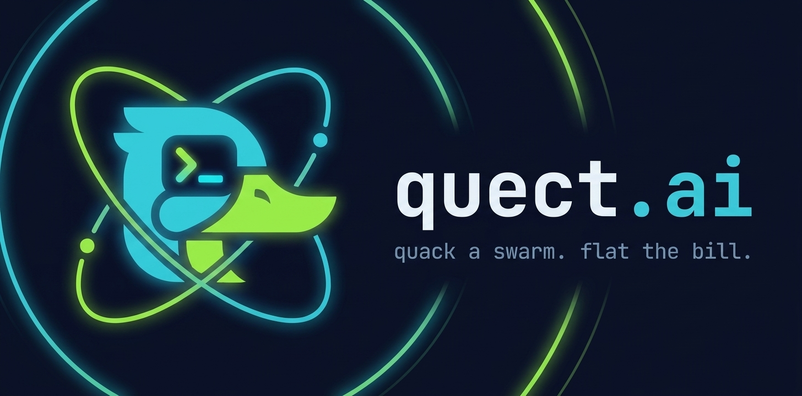

<div align="center">



# 🦆 Quect

### `quack a swarm. flat the bill.`

**Banda dedicada para swarms de agentes de código.**
Inferência flat-rate: uncapped tokens, throughput dedicado, conta previsível — sem bill-shock.

**Português (BR)** · [English](README.en.md) · [Español](README.es.md)

[Discord](https://discord.gg/NkY4NzaCfY) · [Waitlist](https://quect.ai) · [quect.ai](https://quect.ai)

> ⚠️ **Pre-launch · junho 2026.** Beta fechado em waves. Nada no ar ainda — dá uma ⭐ e entra na waitlist; a gente avisa quando o primeiro nó subir.

</div>

---

## O problema

O dev power-user de 2026 paga **$200–600/mês** em token, e o mercado migrou todo pra metering nos últimos 12 meses. A conta é imprevisível:

- **Copilot** — $29 virou **$750**/mês depois do flip pra metering
- **Replit** — plano de $25, bills surpresa de **$100–300**
- **Uber** — capou engenheiros em **$1.500/mês** após queimar o budget anual em 4 meses

Deixar um swarm rodando 24/7 vira roleta-russa de fatura.

## A solução: banda larga para inferência

O mesmo salto que a banda larga deu na telefonia — de pagar por minuto → assinatura fixa com velocidade dedicada. Quect aplica isso a tokens:

- **🦆 Tokens sem limite** — assinatura fixa, loops e swarms 24/7 sem contador rodando no fundo. *(uncapped tokens, fair-use AUP — não "unlimited".)*
- **⚡ Throughput dedicado** — largura de banda em tokens/s por conta. Honesto, previsível, sem letrinha miúda.
- **🌊 Queue gateway** — excesso entra em fila de milissegundos. Nunca bloqueia, nunca cobra extra.

## Pluga nas ferramentas que você já usa

Endpoint **OpenAI-API-compatible** (+ Anthropic). Se o seu agent/harness fala a API, aponta a base URL pro Quect — sem CLI novo, sem migração.

```bash
# OpenAI-compatible (Cline, Aider, Codex, Continue, OpenCode…)
export OPENAI_BASE_URL="https://api.quect.ai/v1"
export OPENAI_API_KEY="qk_..."

# Anthropic-compatible (Claude Code)
export ANTHROPIC_BASE_URL="https://api.quect.ai/anthropic"
export ANTHROPIC_API_KEY="qk_..."
```

```bash
curl https://api.quect.ai/v1/chat/completions \
  -H "Authorization: Bearer $OPENAI_API_KEY" \
  -H "Content-Type: application/json" \
  -d '{
    "model": "quect-swarm",
    "messages": [{"role": "user", "content": "refatora esse módulo"}]
  }'
```

*(Os endpoints entram no ar por wave de beta. O contrato acima é o alvo.)*

## Multi-modelo OSS · routing automático

O modelo certo pra cada tarefa, escolhido automaticamente. Você nunca escolhe o modelo — o roteador manda cada tarefa pro modelo certo, com fallback, nunca 429. Frontier (Sonnet/GPT) entra por pass-through quando necessário.

| Spec (stealth) | Caso de uso | Lane |
|----------------|-------------|------|
| **~12B dense · vision · 256k** | autocomplete · lint-fix · explain · tool-use | fast-lane |
| **~35B MoE · 3B active · 256k** | refactor multi-file · TDD · tool-calling | SWARM driver |
| **~355–600B MoE · ~32B active · 200k** | long-horizon · análise crítica | heavy (pass-through) |

*Catálogo curado pelos melhores modelos open-source do [LMArena WebDev leaderboard](https://arena.ai/leaderboard/code/webdev?license=open-source) · sujeito a mudança.*

## A régua cresce com o swarm

Quect sobe nó por nó. Cada marco da waitlist acende um nó novo — mais banda dedicada, mais agentes em paralelo e modelos melhores no pool curado. Você nunca escolhe nem migra: o roteador sempre manda sua tarefa pro melhor modelo disponível. Mais swarm na comunidade = mais músculo pra todo mundo.

## Preço · puxe a banda

Sem planos rígidos. Você puxa uma régua de throughput (10 → 150 tok/s) e o preço acompanha, ~linear: banda dedicada não fica mais barata de servir, então não tem desconto de volume escondido. Um cano só, dividido entre quantos agentes você quiser (guia: ~1 agente por 30 tok/s).

| Throughput | USD/mês | BRL/mês (Pix)¹ |
|-----------|---------|----------------|
| **10 tok/s** | **$0** · grátis | **R$0** |
| 30 tok/s | $39 | R$199 |
| 60 tok/s | $78 | R$398 |
| 90 tok/s | $117 | R$597 |
| 120 tok/s | $156 | R$796 |
| 150 tok/s | $195 | R$995 |

*Pontos de referência — a régua é contínua no site, de 10 em 10 tok/s. Uncapped tokens, fair-use AUP · tok/s = taxa de refill; excesso entra em fila (never-429). ¹ Preço BR via Pix — sem IOF (3,5%), pagamento local. Preço de lançamento, sujeito a ajuste.*

> 🦆 **Beta founding: 100 vagas.** Os 100 primeiros assinantes levam selo de fundador + assento #1–100, prioridade na fila e acesso ao founder & roadmap. Preço cheio — o perk é status e acesso, não desconto. Entra na waitlist pra pegar a sua.

## Entra na fila

1. ⭐ neste repo
2. Entra no [Discord](https://discord.gg/NkY4NzaCfY)
3. [Waitlist](https://quect.ai) — conta quanto você gasta/mês em token + qual harness usa

## Licença

MIT.

---

<div align="center">
🦆 <i>quack a swarm. flat the bill.</i> · feito por <a href="https://quect.ai">Quect.ai</a>
</div>
